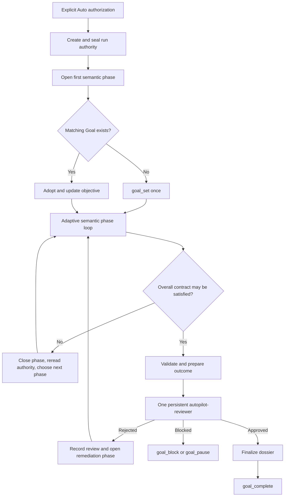

# Autopilot

Autopilot is an explicitly authorized long-horizon execution protocol for OpenCode. It is not a primary agent, a replacement for domain skills, a fixed pipeline, or permission to expand scope silently.

<activation_contract>

Enter Autopilot only after the user clearly authorizes execution with language such as "开始 auto 吧", "start autopilot", or "run this unattended". Mentioning autonomy as an idea is not activation. That explicit start authorizes this skill to create the run dossier and call `goal_set`; do not ask for a second confirmation when a decision-complete Plan already identified the work as an Autopilot run.

Before activation, inspect discoverable project facts and settle only boundaries that materially affect safety or scientific meaning. If the conversation already contains a decision-complete Plan handoff, reuse it. If a required high-impact boundary is still missing, ask one grouped question before treating the run as activated.

Once activated, do not call `question` until the run terminates or the user interrupts. Resolve reversible ambiguity with the most conservative useful choice and record it in the appropriate semantic phase. Stop on an irreversible choice, unavailable authorization, unsafe action, or genuinely human-only decision.

If the active agent is `plan` or `labflow-plan`, remain read-only. Produce the decision-complete handoff but do not create files, set or resume a Goal, or execute work until the user switches to an executing primary agent.

</activation_contract>

<flipped_preflight>

Treat the user's first statement as motivation, symptoms, direction, or a desired change rather than mechanically accepting it as the final objective. Autonomy amplifies goal errors, so teach back one concise current-best interpretation after inspecting the project and evidence:

- what the user actually wants to become true;
- why that outcome matters;
- evidence separating completion, feasibility, disconfirmation, and failure;
- fixed semantic decisions, non-goals, and human judgment gates;
- the autonomy envelope and forbidden side effects.

Separate goal uncertainty from method uncertainty. Resolve goal uncertainty collaboratively before launch. Leave implementation route, experiment design, architecture, hyperparameters, candidate portfolio, and phase decomposition adaptive unless they change the intended outcome or authorization boundary.

When useful in `labflow-plan`, converge through `What I Think You Actually Want`, `Why This Is The Right Target`, `Success And Failure Boundary`, `Autonomy Envelope`, `Decisions Only You Can Make`, and `Autopilot Contract`. This defines where to go without prescribing every step.

</flipped_preflight>

<run_authority>

Read `references/run-dossier.md`, then use the bundled `scripts/autopilot.py` CLI for lifecycle operations. Every activation creates a new `.autopilot/<UTC-timestamp>-<semantic-slug>/` run under the approved topic root; default to the Git root when no other root was settled. A later independent Autopilot starts another run unless the user explicitly asks to resume an existing run.

Preserve the complete approved proposed plan plus later decisive user instructions in `source.md`. Author `contract.md` in plain human language with the stable intent, success/failure boundary, fixed decisions, non-goals, method freedom, and human gates. Put profile, workspace, read/write scope, Git strategy, budgets, resources, side-effect authorization, and stop conditions in the separate `envelope.md`.

Seal source, contract, and envelope before execution. Never directly modify sealed authority. A user-authorized semantic change closes the current phase, creates and seals one numbered amendment, then opens a phase against the new authority head. Ordinary questions, implementation choices, failed methods, and evidence-guided pivots are not amendments.

Do not maintain a duplicate Autopilot runtime log. Native `todowrite`, Goal state, `pty_list`, OpenCode child sessions, Git, and real project artifacts remain authoritative for operational details. Update the dossier only at information-bearing boundaries: activation, amendment, semantic-phase transition, convergence review, and finalization.

</run_authority>

<goal_ownership>

At activation, call `goal_status` before changing Goal state.

- If no Goal exists, seal authority, open the first semantic phase, render the Goal projection with the CLI, then call `goal_set` once with every rendered field, including `objective`, `successCriteria`, `constraints`, `mode: normal`, and the sealed per-run turn, duration, and token limits.
- If a user-created Goal clearly represents the same Autopilot task, preserve its original objective in `source.md`, establish the dossier, then use `update_goal` to replace only its objective with the rendered projection. Resume it when the activation message paused it.
- If an existing Goal is semantically different or ownership is ambiguous, do not replace or clear it silently; resolve that conflict before activation.

One Autopilot run owns one Goal. A semantic phase is not a Goal. At each phase transition, run dossier validation, re-read effective authority, close the current phase, select and open the next phase, render a new projection, and call `update_goal` with only the new objective. Keep Goal success criteria, constraints, identity, history, and budget lineage intact.

Do not use `/goal add`, `/goal focus`, `/goal sequence`, or another focused Goal while an Autopilot run is active. The adapter's completion binding is session-scoped and intentionally fails safe for one run; multi-Goal orchestration belongs outside this protocol.

The rendered projection carries an absolute dossier identity. The Goal adapter binds that identity when `goal_set`, `update_goal`, or recovery status tools observe it, and supplies a completion-only external guard: ordinary continuation remains active, but completion markers and completion tools are rejected until the bound manifest is `finalized`. After restart, call `goal_status` before work so the adapter restores this binding from the persisted objective.

Use `goal_pause` for an intentional retained stop, `goal_resume` only with explicit user authorization to continue, `goal_block` for a concrete external or human requirement, and `goal_complete` only after final dossier validation and independent approval. Never use phase completion as Goal completion. Do not call `clear_goal` unless the user explicitly discards the run.

</goal_ownership>

<semantic_phase_loop>

Use semantic phases to describe the current task meaning, not engineering ceremony. `phases/current.md` states the current semantic objective, why it matters now, entry evidence, exit evidence, and allowed pivots. Git anchors, commits, commands, file-by-file edits, PTY IDs, and routine checks belong to native operational tools, not the semantic phase.

Repeat an adaptive loop:

1. Orient on effective authority, the current phase, retained project evidence, Goal state, and any genuinely active work.
2. Maintain meaningfully different candidate routes before overcommitting to one autoregressive path.
3. Choose actions with the highest expected information gain or contract progress.
4. Execute direct work, bounded background evidence lanes, or formal PTY jobs according to the selected profile.
5. Verify against the relevant evidence ladder, including counterevidence and confounds.
6. Retain, revise, combine, or discard run-owned changes without touching unrelated work.
7. When phase exit evidence is met, record the outcome and rationale, close it, re-read authority, then choose the next semantic phase or enter convergence.

Phases may branch, revisit an earlier mechanism, or reject a route. Do not predeclare a rigid sequence merely to make the dossier look planned. When plausible routes are exhausted, preserve the supported failure boundary rather than spending the remaining budget on low-information variants.

</semantic_phase_loop>

<maximum_useful_parallelism>

Use maximum useful parallelism, not maximum process count. Form orthogonal candidate lanes so parallel work reduces anchoring bias rather than duplicating the favored route. Give each lane a disjoint question, write or output scope, configuration identity, and expected return; the primary owns integration and every long-running process.

Before runtime probes or experiments, state expected GPU, VRAM, CPU, RAM, disk, wall time, and output footprint. Inspect live resources, start one representative canary when peak use is uncertain, then scale only after reliable startup or completed small-probe evidence. Do not create contention that invalidates wall-clock, throughput, memory, randomness, or simulator comparisons.

</maximum_useful_parallelism>

<event_driven_work>

Use ordinary bounded commands for short work, background subagents for independent read-heavy evidence lanes, and PTY sessions for long, interactive, or formal processes. PTYs must use an exact project-local workdir, descriptive title, `notifyOnExit: true`, and a natural safety timeout when the job should finish. Do not poll with sleep loops.

The Goal-PTY adapter defers Goal continuation only for notifying PTYs owned by the same session while they are `running` or `killing`. Long-lived non-notifying dashboards, REPLs, watch modes, and services do not block Goal. After a notifying PTY exits, handle its completion evidence and finish the turn; Goal continues only after the session returns idle.

After compaction or recovery, validate the dossier, inspect existing PTYs and child sessions before launching anything, recover native TODO/Git state, and resume from the current semantic phase. Never duplicate a process because conversational memory is incomplete.

</event_driven_work>

<human_interruption>

Human messages supersede unattended execution and normally pause Goal.

- If the user explicitly says the question does not interrupt Auto and authorizes continuation, answer it without changing authority, then call `goal_resume` on the same Goal.
- If the user changes high-level intent, keep Goal paused, close the current phase as superseded, seal an amendment carrying the decisive instruction, reassess the phase, and resume only when the new authority is coherent.
- If the user pauses, redirects outside the sealed envelope, or does not explicitly authorize continuation, remain paused.

Do not use `goal_set` to recover from an interruption; that would replace the run identity and history.

</human_interruption>

<convergence_gate>

Enter convergence only when the primary believes the overall contract, not merely the current phase, may be satisfied. Close the final phase, complete `outcome.md`, validate the run, and use the CLI to open a review identity bound to the exact authority head and outcome digest.

Launch the hidden `autopilot-reviewer` with the CLI-provided assignment. Its first action is `autopilot_review_attest`, which validates the run and binds the actual reviewer session ID in the manifest. One run owns one reviewer task identity. During ordinary execution do not consult this reviewer. If it rejects the outcome, record the verdict, open a remediation phase, continue work, and later resume the same reviewer task with the new review identity and evidence. Never create a more agreeable replacement reviewer.

The reviewer's Agent definition owns its independence, evidence, probe, write, and verdict contract; do not duplicate or weaken those rules in the assignment. Record its exact structured verdict through the CLI. A rejected verdict cannot be overridden. If the reviewer task fails operationally, retry the same task once with focused recovery context; if it still cannot return a valid verdict, pause Goal and report the review failure.

Formal probe reservations and review recording share one CLI lock. If the reviewer host is interrupted after reserving a probe, do not edit the manifest: after the recorded PID identity is gone and its deadline expires, use `review recover` with an auditable reason, then continue or record the verdict.

After approval, do not alter outcome or authority. Run finalization, then call `goal_complete` with a structured criterion/evidence mapping, checks, changed files, and known limitations derived from the sealed dossier and approved review. If a contract-defined human gate remains, use `goal_block` instead of treating reviewer approval as human acceptance.

</convergence_gate>

<git_and_side_effects>

Autopilot dossiers remain local-only through their own validated `.gitignore`; version accepted project artifacts outside the dossier according to the sealed Git policy. Protect unrelated dirty changes and stage only run-owned work. Create recovery anchors and semantic checkpoint commits when they materially improve recoverability.

Do not bump versions, perform release closure, create release tags, push, publish, deploy, send external messages, purchase resources, rotate credentials, or change production unless the sealed envelope explicitly authorizes that exact side effect. Never use destructive Git recovery against work not created by this run.

</git_and_side_effects>

<profiles>

Read exactly one primary profile for the run: `references/research.md`, `references/coding.md`, or `references/paper.md`. Profiles are self-contained and may call existing abilities such as codebase research, literature forensics, PDF reading, image generation, learning forensics, or Git task flow without becoming another profile.

</profiles>

<stop_and_handoff>

Stop on approved completion, explicit user pause, exhausted wall-clock/resource budget, a safety boundary, an external hard blocker, dossier integrity failure, or systematic evidence that no defensible next route remains.

Before a retained stop, reconcile active PTYs and children, preserve valid outputs, run the strongest affordable checks, close or clearly leave the current phase, and update `outcome.md` only when presenting an overall candidate or terminal failure boundary. Do not fabricate completion, reviewer approval, scientific acceptance, or human judgment.

</stop_and_handoff>
