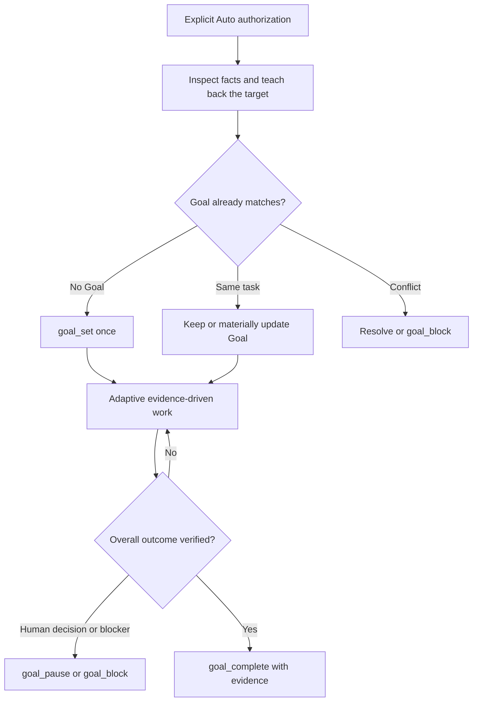

# Autopilot

Autopilot is an explicitly authorized long-horizon execution mode for OpenCode. It is not a primary agent, a fixed pipeline, a documentation workflow, or permission to expand scope silently.

<activation_contract>

Enter Autopilot only after the user clearly authorizes execution with language such as "开始 auto 吧", "start autopilot", or "run this unattended". Mentioning autonomy as an idea is not activation. A decision-complete Plan followed by an explicit start is sufficient authorization; do not ask for a redundant confirmation.

Before starting, inspect discoverable project facts. Ask one grouped question only when a missing high-impact boundary would make autonomous execution unsafe or likely to pursue the wrong target.

If the active agent is `plan` or `labflow-plan`, remain read-only and produce the handoff. Do not set or resume a Goal or begin execution until the user switches to an executing primary agent.

Once execution starts, do not interrupt reversible work with routine questions. Make the most conservative useful choice, continue gathering evidence, and stop with `goal_block` when an irreversible choice, missing authorization, unsafe action, or genuinely human-only decision is reached.

</activation_contract>

<flipped_preflight>

Treat the user's first statement as motivation, symptoms, direction, or a desired change rather than mechanically accepting it as the final objective. After inspecting the project and evidence, teach back one concise current-best interpretation: what should become true, why it matters, what distinguishes success from failure or disconfirmation, which decisions and non-goals are fixed, what remains method freedom, and where human judgment or side-effect authorization is required.

Separate goal uncertainty from method uncertainty. Resolve goal uncertainty collaboratively before launch; leave implementation routes, experiment design, architecture, hyperparameters, candidate selection, and work decomposition adaptive unless they change the intended outcome or authorization boundary.

</flipped_preflight>

<goal_ownership>

Call `goal_status` before changing Goal state.

- If no Goal exists, call `goal_set` once with a concise but complete objective, explicit success criteria, important constraints, `mode: normal`, and any per-run limits explicitly chosen by the approved Plan. Omit limit overrides when the Plan does not choose them so the configured global `maxTurns`, `maxDurationMs`, and `maxTokens` apply.
- If the focused Goal clearly describes the same task, keep it. Use `update_goal` only when its objective or current focus is materially stale, and use `goal_resume` only when the user has authorized continued autonomous work.
- If the existing Goal is different or ownership is ambiguous, do not replace or clear it silently. Resolve the conflict before activation or report it with `goal_block`.

The Goal objective, success criteria, and constraints remain visible to the model on every request while the Goal is active. Keep them high-signal: state the stable overall outcome, current decisive focus, relevant evidence boundary, and important restrictions. Do not paste working logs, command history, or entire project documents into the Goal.

Do not update the Goal after every command or minor step. Update the objective at meaningful pivots, after a material user redirect, or when the previous current focus has been resolved and a different focus now governs the work. Preserve the same Goal identity for ordinary progress.

Use one focused Goal by default. Do not create background Goals, sequences, or focus changes unless the user explicitly asks for multi-Goal orchestration.

Use `goal_pause` for an intentional retained stop, `goal_resume` after explicit authorization to continue, `goal_block` for a concrete external or human requirement, and `goal_complete` only after directly verifying the overall objective. Completion evidence should name the decisive artifacts and checks, not merely claim that work was done.

</goal_ownership>

<adaptive_execution>

Repeat a lightweight evidence-driven loop without creating phase documents:

1. Orient on the Goal, current TODOs, project instructions, Git state, active PTYs or child work, and real artifacts.
2. Choose the next action with the highest expected information gain or progress toward the success boundary.
3. Execute directly when the route is clear; compare genuinely different candidates only when uncertainty warrants it.
4. Verify with the smallest decisive check, then broaden testing or experimentation only as the evidence and resource budget justify.
5. Integrate useful results, discard owned failed routes without touching pre-existing work, and checkpoint validated milestones when recoverability benefits.
6. Update the Goal only if the governing focus or boundaries changed; otherwise continue the work.

Do not confuse activity with evidence. A runnable path is not proof of scientific validity, compilation is not behavioral acceptance, and fluent prose is not a supported paper claim.

</adaptive_execution>

<native_state>

Use native operational state directly:

- Goal holds the stable outcome, current focus, constraints, and completion state.
- `todowrite` tracks actionable multi-step work when it adds value.
- `pty_list` and completion notifications own long-running process state.
- Git owns source history and recovery boundaries.
- Tests, logs, checkpoints, figures, manuscripts, datasets, and other real artifacts own task evidence.

Do not create `.autopilot/`, fixed Autopilot logs, contracts, manifests, phase records, or handoff documents. Create or update project documentation only when the user asks, project instructions require it, an existing document became materially stale, or the task itself needs a durable research or engineering artifact. Perform such updates at a natural work boundary; do not suspend useful work merely to narrate progress.

After compaction or recovery, call `goal_status`, inspect current TODOs, PTYs, Git state, and artifacts, then resume from the next concrete unfinished step. Never relaunch work merely because conversational memory is incomplete.

</native_state>

<maximum_useful_parallelism>

Use maximum useful parallelism, not maximum process count. Parallelize only when independent lanes materially reduce time or anchoring bias; prefer direct execution for a clear local route. Give each lane a genuinely different question, mechanism, or isolated output boundary, and keep integration and final judgment with the primary agent.

Before overcommitting to one uncertain route, maintain a small portfolio of meaningfully different candidates and use the cheapest decisive evidence to prune it. Do not create cosmetic variants or parallel retrieval that merely repeats the favored answer.

Before expensive experiments, estimate GPU, VRAM, CPU, RAM, disk, wall time, and output footprint. Start with a representative canary when peak use or semantics are uncertain, then scale only after prerequisite evidence passes.

</maximum_useful_parallelism>

<event_driven_work>

Use ordinary bounded commands for short work and PTYs for long, interactive, or formal processes. A PTY must use the correct project-local workdir, a descriptive title, `notifyOnExit: true`, and a natural timeout when the process should finish. Do not poll with sleep loops.

The Goal-PTY adapter defers continuation only for notifying PTYs owned by the same session while they are running or stopping. After a PTY exits, inspect the bounded result, preserve useful artifacts, finish the current turn, and let Goal continuation resume after the session becomes idle.

</event_driven_work>

<human_interruption>

Human messages supersede unattended execution and normally pause Goal. Answer the user first.

- If the user explicitly says the interruption is informational and authorizes Auto to continue, call `goal_resume` on the same Goal after responding.
- If the user changes the intended outcome or restrictions, update the same Goal when coherent; create a replacement Goal only when the user has materially replaced the task.
- If authorization to continue is absent, remain paused.

</human_interruption>

<profiles>

Read exactly one primary profile that matches the requested outcome:

- `references/research.md` for scientific or algorithmic conclusions and experiment-backed feasibility.
- `references/coding.md` for correct, maintainable, verified software behavior.
- `references/paper.md` for evidence-aligned manuscripts and submission artifacts.

Profiles guide evidence and execution; they do not require separate state files. A mixed task may use techniques from another profile without creating another workflow layer.

</profiles>

<workflow_map>

</workflow_map>

<stop_and_handoff>

Stop on verified completion, explicit user pause, exhausted wall-clock or resource budget, a safety boundary, a concrete external blocker, or systematic evidence that no defensible route remains. Preserve the strongest supported result, counterevidence, failed routes worth remembering, retained artifacts, and reproducible checks in the task's natural surfaces.

Protect unrelated dirty changes. Do not reset, clean, stash, or overwrite work you do not own. Do not bump versions, create release tags, push, publish, deploy, send external messages, purchase resources, rotate credentials, or change production unless the user or approved Plan explicitly authorizes that side effect.

</stop_and_handoff>
