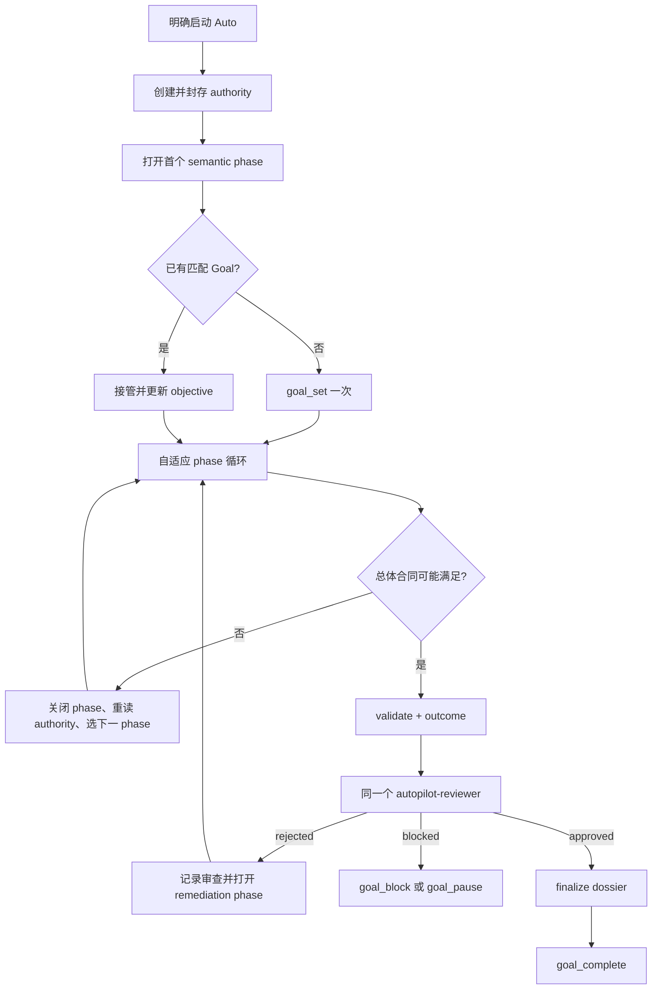

# Autopilot

Autopilot 是用户明确授权的 OpenCode 长程执行协议，不是 primary agent、不替代领域 skill、不采用固定流水线，也不允许静默扩权。

## 启动边界

只有“开始 auto 吧”“启动 autoresearch”“无人值守执行”等明确表达才激活。若 decision-complete Plan 已说明这将是 Auto，启动语句本身就授权 Agent 创建 dossier 并调用 `goal_set`，不再二次确认。若仍缺少会改变安全、科研语义或不可逆副作用的边界，在真正启动前只问一个聚合问题。

启动后直到结束或用户插话，不主动调用 `question`。可逆细节采用保守且有用的选择；不可逆选择、缺少授权、危险动作或必须由人判断的门直接停止。若当前仍是 `plan` 或 `labflow-plan`，只能形成只读交接，不能建档、设置 Goal 或执行。

Auto 前先读取项目和证据，用普通语言回译真正目标、成功/失败边界、固定决定、non-goals、人类验收门和自治范围。目标不确定性在启动前解决；方法路线、实验设计、架构、超参数和 phase 分解留给自主循环。

## Run Authority

读取 `references/run-dossier.md`，所有生命周期操作使用 skill 内置的 `scripts/autopilot.py`。每次激活在 topic root 下创建新的 `.autopilot/<UTC-timestamp>-<semantic-slug>/`；未另行决定时使用 Git 根目录。下一次独立 Auto 新建目录，除非用户明确恢复旧 run。

- `source.md`：approved `proposed_plan` 与之后改变语义的用户拍板原文。
- `contract.md`：总体意图、成功与失败边界、固定决定、non-goals、方法自由和人类验收门。
- `envelope.md`：profile、workspace、读写范围、Git 策略、预算、资源、副作用授权和停止条件。
- `phases/current.md`：当前 semantic phase 的目标、进入原因、退出证据和允许 pivot。
- `outcome.md`：总体完成候选或终止边界。
- `manifest.json`：CLI 独占的 digest、phase、review 和最终状态。

执行前一次性封存 source、contract 与 envelope。不得直接修改 sealed authority；明确的用户语义变化必须先关闭当前 phase，再创建编号 amendment 并针对新 authority 打开 phase。普通问答、实现选择、失败方法和证据驱动 pivot 都不是 amendment。

不维护重复的 `runtime.md`。TODO、Goal、PTY、background child、Git 和实际项目产物各自是运行事实源。Dossier 只在启动、amendment、phase transition、review 和 finalize 等信息边界更新。

## Goal 所有权

启动时先调用 `goal_status`：

- 没有 Goal：封存 authority、打开首 phase、用 CLI 渲染投影，再把 objective、success criteria、constraints、normal mode 和 sealed turn/duration/token limits 一并传给一次 `goal_set`。
- 用户已通过 `/goal` 建立同一任务：先把原始 objective 保存进 source，再用 `update_goal` 只替换 objective；若启动消息使其暂停，再恢复同一个 Goal。
- 已有 Goal 语义不同或归属不明：不得静默替换或清除，先解决冲突。

一个 run 只有一个 Goal。Semantic phase 不是子 Goal；phase 切换时 validate、重读 authority、关闭 current、选择下一 phase、重新渲染并只更新 objective。保留 Goal 的 success criteria、constraints、身份、历史和预算谱系。

Autopilot active 时不得使用 `/goal add`、`/goal focus`、`/goal sequence` 或切换到另一个 focused Goal。Adapter 的 completion binding 按 session 绑定一个 run 并采取 fail-safe；多 Goal 编排不属于本协议。

渲染后的 objective 带绝对 dossier identity。Goal adapter 会在 `goal_set`、`update_goal` 或恢复状态读取时绑定它，并提供 completion-only external guard：普通 continuation 不受影响，但 manifest 尚未 `finalized` 时，无论 marker 还是 completion tool 都会被拒绝。重启后先调用 `goal_status`，让 adapter 从持久化 objective 恢复绑定。

有意保留停止用 `goal_pause`；只有用户明确继续才 `goal_resume`；具体外部需求用 `goal_block`；完成整个合同且独立审查通过后才 `goal_complete`。除非用户明确丢弃 run，不调用 `clear_goal`。

## 自适应 Semantic Phase

Phase 描述当前任务语义，不记录 Git 锚点、commit、命令、逐文件编辑、PTY ID 或 routine checks。循环为：读取 authority 与当前证据 → 维护机制不同的候选路线 → 选择最高信息增益动作 → 直接执行/委派/PTY → 验证正反证据 → 保留或放弃变化 → 达到 phase exit 后记录结论、重读 authority 并选择下一 phase或进入收束。

Phase 可以分叉、回退和拒绝路线，不为了形式整齐预设固定 sequence。路线空间真正耗尽时保留受证据支持的失败边界，不用剩余预算刷低信息变体。

## 最大有效并行与 PTY

并行用于降低路线偏见和缩短证据时间，不用于填满进程。每条 lane 必须有不同问题、隔离写入或输出、配置身份和预期返回；主 Agent 负责整合并拥有全部长进程。

短任务用普通命令，独立 read-heavy 证据用 background subagent，长时、交互或正式过程用 PTY。PTY 必须设置准确 workdir、标题、`notifyOnExit: true` 和适用超时，禁止 sleep/poll。Goal×PTY adapter 只等待同 session 中 notifying 且处于 `running/killing` 的 PTY；退出通知由主 Agent处理并结束当前 turn，session 再次 idle 后 Goal 才继续。

Compact 或恢复后先 validate dossier，检查已有 PTY 与 child session，再恢复 native TODO/Git 和 current phase；不得因对话记忆不完整重复启动进程。

## 用户插话

用户消息优先并通常暂停 Goal：

- 明确说“不干扰，继续 Auto”：回答问题，不修改 authority，然后 `goal_resume` 同一个 Goal。
- 改变高层意图：保持暂停，将 current 以 superseded 结论关闭，封存 amendment，重新判断 phase 后再恢复。
- 仅暂停、越出 envelope 或没有明确授权继续：保持暂停。

插话后不能用 `goal_set` 恢复，否则会替换 run 身份和历史。

## 独立收束审查

只有主 Agent认为总体合同可能达成时才进入 convergence：关闭最后 phase、完成 outcome、validate，并用 CLI 绑定精确 authority head 与 outcome digest 打开 review。

每个 run 只创建一个 hidden `autopilot-reviewer` task。它的第一个动作必须是 `autopilot_review_attest`，由 host 校验 dossier 并把真实 reviewer session ID 绑定进 manifest。正常执行中不把 reviewer 当顾问；若 rejected，记录 verdict、打开 remediation phase，之后必须 resume 同一 task 复审，不能另建一个更好说话的 reviewer。

Reviewer 的独立性、证据、短 probe、写入和 verdict 规则只由它自己的 Agent Markdown 定义，assignment 不重复也不弱化。Rejected 不得 override；同 task 聚焦重试后仍无法形成合法 verdict，则暂停并报告审查故障。

Formal probe reservation 与 review record 共用 CLI lock。若 reviewer host 在预约 probe 后中断，不得手改 manifest；确认记录的 PID identity 已消失且 deadline 过期后，用 `review recover` 和可审计原因恢复，再继续或记录 verdict。

Approved 后不得再修改 authority 或 outcome；先 finalize dossier，再根据 sealed dossier 与审查结果提交结构化 `goal_complete`。合同若仍有必须由人判断的 gate，只能 `goal_block`。

## Git、Profile 与停止

Dossier 始终通过自己的受校验 `.gitignore` 保持 local-only；需要版本化的正式项目产物放在 dossier 外，并遵循 sealed Git policy。保护无关 dirty changes，只暂存 run-owned 工作。未明确授权时不得 bump、release closure、tag、push、发布、部署、发外部消息、购买资源、轮换凭据或改生产。

每次只读取一个主 profile：`references/research.md`、`references/coding.md` 或 `references/paper.md`。它们可以调用现有 abilities，但不会叠加成第二个 profile。

在 approved completion、用户暂停、预算耗尽、安全边界、外部硬阻塞、integrity failure，或系统性证据表明已无可辩护路线时停止。不得伪造完成、reviewer approval、科研验收或人类判断。
