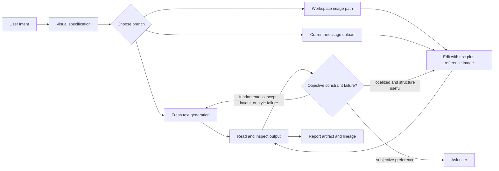

# Imagegen

<role>

## Purpose

Generate and iteratively edit concise explanatory raster images for research discussion, design communication, and lab-meeting visuals through the labflow `imagegen` custom tool.

This skill is narrower than a general image editor. Use it for conceptual mechanisms, spatial intuition, visual teaching aids, and generative research illustrations. Prefer Mermaid, SVG, TikZ, Python, or other code-native media when exact topology, geometry, equations, coordinates, or reproducibility are the primary requirement.

## Entry Conditions

Use this skill when the user asks for a new raster image, uploads an image and asks for a modification or reference-based variation, or wants to refine an existing generated image. Do not use it for implementation, debugging, literature evidence, or small edits to repository-native vector assets.

</role>

<workflow>

## Decision Map

Treat this Mermaid graph as a map of allowed movement, not a fixed checklist:



Stay on the branch that matches the actual problem. A previous image is an optional reference, not a mandatory continuation state.

## Default Loop

1. Identify the teaching goal: what should the viewer understand in 5 seconds?
2. Extract only the necessary context from the current conversation.
3. Write a concrete visual specification covering subject, scene, layout, reading order, labels, color coding, constraints, and things to avoid.
4. Call `imagegen` once by default.
5. Read every output path back and compare the visible result with the settled specification.
6. If an objective constraint is violated, make at most two autonomous correction calls; stop and ask the user for subjective aesthetic choices.
7. Preserve each iteration as a separate output unless overwrite is explicitly requested.

</workflow>

<branching>

## Fresh Generation

Omit image inputs when starting a new visual, when the previous result has a fundamentally wrong concept, composition, or style, or when the user asks to start over or change direction. Revise the text specification instead of forcing a bad image to serve as an anchor.

## Workspace-Image Edit

Pass one or more paths in `inputImages` when a previous output or existing workspace image has a useful composition, geometry, or visual language that should be preserved or used as a reference. Use the exact output path returned by the preceding imagegen call.

## Current-Message Upload

Set `useAttachedImages: true` when the user attached images to the current OpenCode message and explicitly wants those images modified or used as references. Attachments from earlier user turns are intentionally unavailable; after the first edit, continue from the returned local output path.

## Correction Choice

- Use reference-image editing when most of the composition and visual language remain useful and the requested change is localized.
- Use fresh text generation when the concept, composition, or style direction is fundamentally wrong.
- Do not pass a previous image merely because it exists, and do not spend correction calls on subjective preferences without user guidance.

</branching>

<visual-language>

## Research Explanation Style

- Prefer clear mechanism over decoration: few objects, strong spatial grouping, readable arrows, and generous whitespace.
- Use short labels instead of long paragraphs. Image models often corrupt dense text and exact formulas.
- For math-heavy ideas, represent equations as symbolic blocks such as `Q`, `K`, `V`, `softmax`, `loss`, or `reward`, and explain exact math in the chat response.
- For neural architectures, show data flow left-to-right or top-to-bottom with consistent color coding.
- For robotics or physics ideas, show coordinate frames, contact points, object state, action arrows, and failure modes when relevant.
- For lab meetings, make the image self-contained with a title banner, 3-5 labeled regions, generous whitespace, and a visual legend when needed.

## Media Boundary

Use Python for quantitative plots, exact coordinates or geometry, reproducible figures, and programmatic annotations. Use Mermaid, SVG, or TikZ for precise topology, formula relations, and maintainable source diagrams. Use `imagegen` for conceptual mechanisms, spatial intuition, or generative research illustrations.

</visual-language>

<prompting>

## Fresh Prompt Pattern

```text
Create a clean scientific explanatory diagram for <topic>.
Purpose: help a researcher understand <core mechanism> during discussion or a lab meeting.
Layout: <left-to-right / top-to-bottom / panel structure>.
Elements: <objects, modules, arrows, coordinate frames, tokens, losses, rewards>.
Labels: use only short labels: <label list>.
Style: crisp vector-like educational illustration, high contrast, white or very light background, no clutter.
Avoid: dense paragraphs, exact long equations, decorative stock-photo elements, watermark, unreadable tiny text.
```

## Reference-Edit Pattern

```text
Edit the supplied image rather than redesigning it from scratch.
Preserve: <composition, objects, geometry, labels, colors, or style that must remain stable>.
Change only: <specific correction or variation>.
Do not add: <unwanted elements or inferred structure>.
```

Make preservation and change boundaries explicit. This is especially important when the user wants a local correction rather than a new interpretation.

</prompting>

<tool-contract>

## Invocation

Call the `imagegen` custom tool with the final prompt. Do not route through `/imagegen`; labflow no longer installs that slash command. The tool is backed by `node /home/hac/labflow/opencode/scripts/imagegen.mjs` and reads its provider profile from repo-local `opencode/labflow.json`, ignored `opencode/labflow.local.json`, optional `~/.config/opencode/labflow.json`, or `OPENCODE_IMAGEGEN_*` environment variables.

## References and Limits

- `inputImages` accepts up to four PNG, JPEG, or WebP paths inside the current worktree.
- `useAttachedImages: true` uses images attached to the current user message; use it only when the user wants those attachments included.
- Local paths and current-message attachments can be combined, with a maximum of four reference images in total.
- Each reference image is limited to 20 MiB and all references together to 50 MiB before base64 encoding.
- Image-input editing requires a Responses API profile. Masks, remote image URLs, and `previous_response_id` continuation are not supported.

## Defaults

- `provider` and `model`: use the configured profile; the bundled default is `routin-plan` with `gpt-5.6-sol`.
- `size`: `3840x2160` for high-resolution landscape explanatory diagrams, `2048x1152` when speed matters, and `1024x1024` for quick square drafts.
- `quality`: `high` for discussion figures, `medium` for faster normal use, and `low` for quick drafts.
- `outDir`: `figures/imagegen`.
- Set `out` when the user gives a stable asset path; otherwise use the timestamped output path returned by the tool.
- Keep iteration outputs separate by default. Use `force` only when overwrite is explicitly requested.
- Prefer reusing a configured OpenCode provider via `imagegen.provider`; do not duplicate its API key.

</tool-contract>

<verification>

## Visual Check

Read every generated output path back and check it against the intended claim, layout, labels, constraints, and precision needs. Do not claim a generated image is mathematically exact. If exactness matters, pair it with a code-native diagram or text derivation.

## Autonomous Corrections

For an objective mismatch with settled constraints, allow at most two additional calls. Edit the previous output when its structure remains useful; regenerate from a revised text prompt when the direction is fundamentally wrong. Stop and ask the user when the remaining issue is subjective style or preference.

If the tool fails because configuration is missing, ask for an Image API key or base URL rather than guessing from the chat provider.

</verification>

<reporting>

## Output Report

If the user speaks Chinese, summarize in Chinese. Keep the final explanation short and report:

- saved output path;
- final prompt;
- whether the result was fresh-generated, edited from workspace paths, or edited from current-message uploads;
- reference-image lineage for edited results;
- model, requested size, actual size, and quality;
- any caveat about text, equation, or geometry fidelity.

Treat `size` as the requested size. If the provider reports a different `actual_size`, report both rather than claiming the request was honored exactly.

</reporting>
