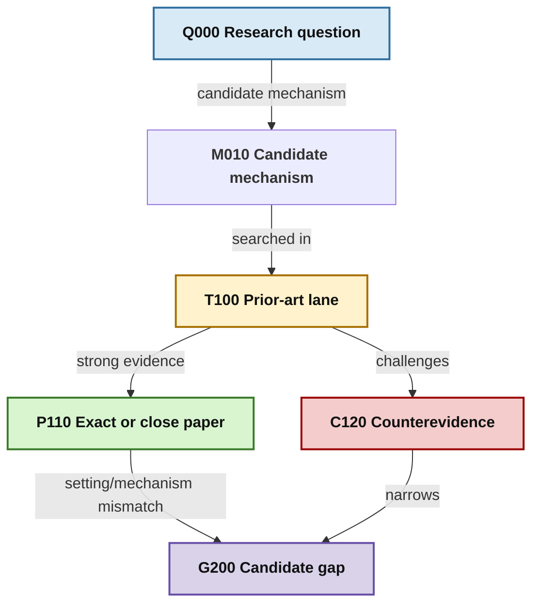

# Curated Literature MAP Template

`MAP.md` is a human-curated semantic map, not the complete citation graph. Keep
only nodes that affect the research decision.

```md
---
graph_id: <topic>
title: <title>
status: active
updated: 2026-07-10
search_cutoff: 2026-07-10
---

# <Title> MAP

## Research Question

<One bounded question.>

## Graph



## Node Index

| Node | Artifact | Class | Evidence depth | Meaning |
|---|---|---|---|---|
| T100 | [topic](topics/example.md) | close | targeted | ... |
| P110 | [topic evidence](topics/example.md#core-works) | exact | lead targeted | ... |

## Evidence Diagnosis

## Novelty Boundary

## Candidate Next Searches

## Map Invariants

- Promote only screened evidence into the map.
- Link every paper/topic node to its artifact.
- Keep exact, analogue, background, and counterevidence visually distinct.
- State the search cutoff for every absence-based inference.
```

Store raw graph and audit evidence under `.research/`; never auto-overwrite the
curated human map with machine output.
